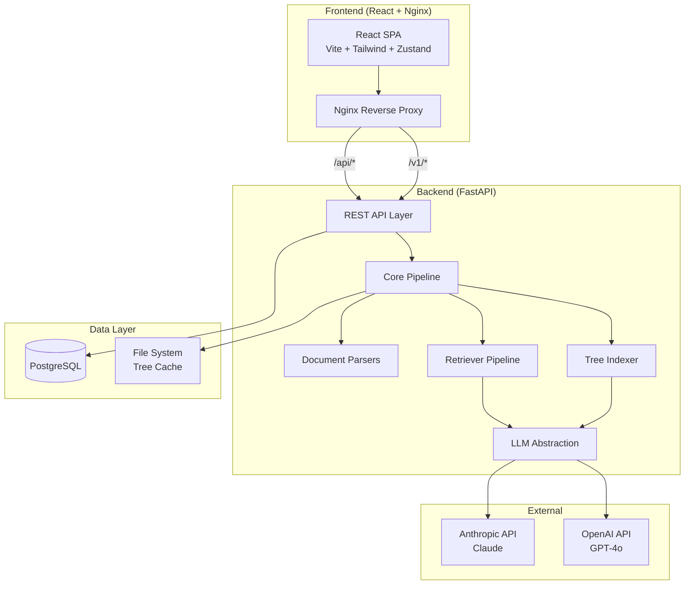
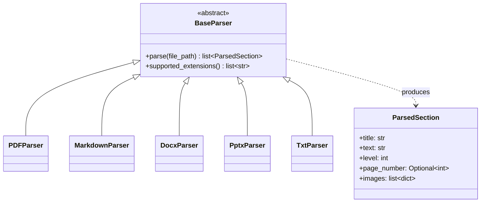
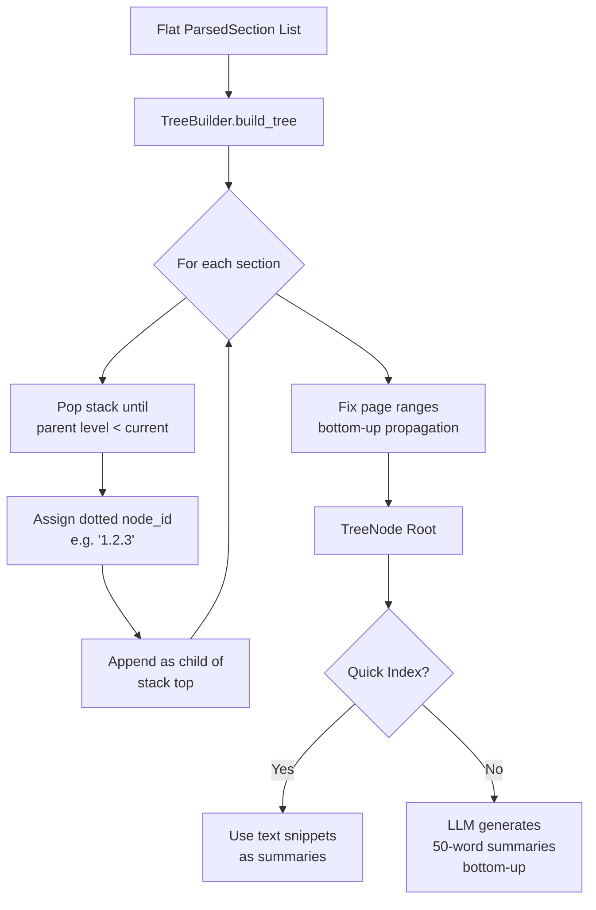
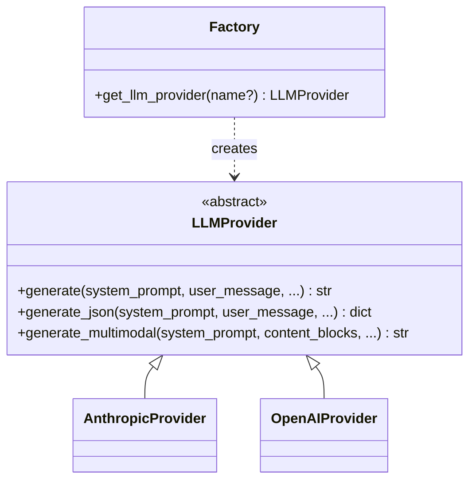
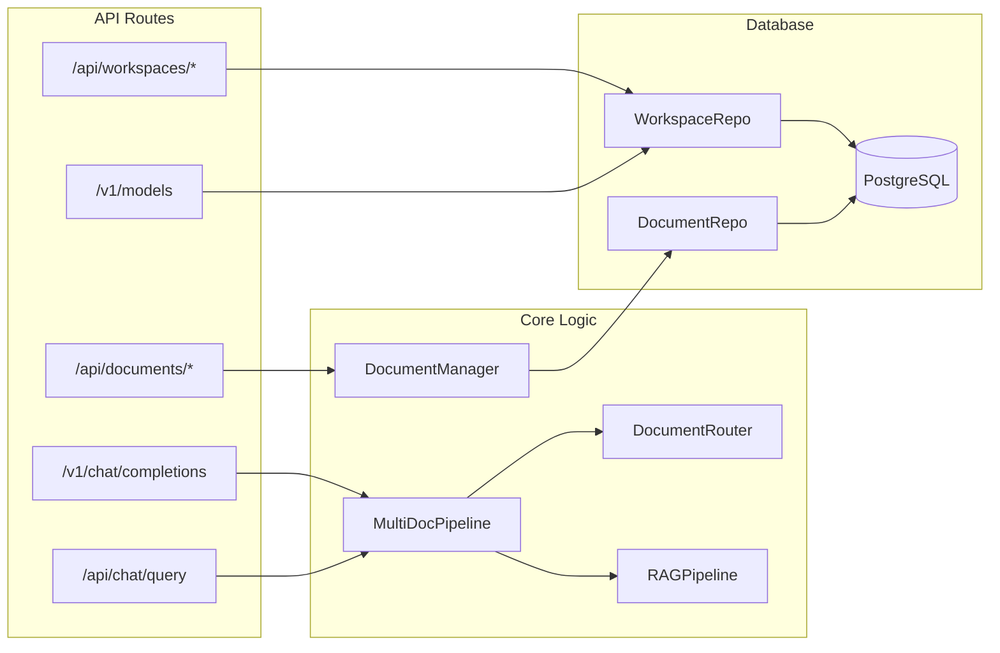
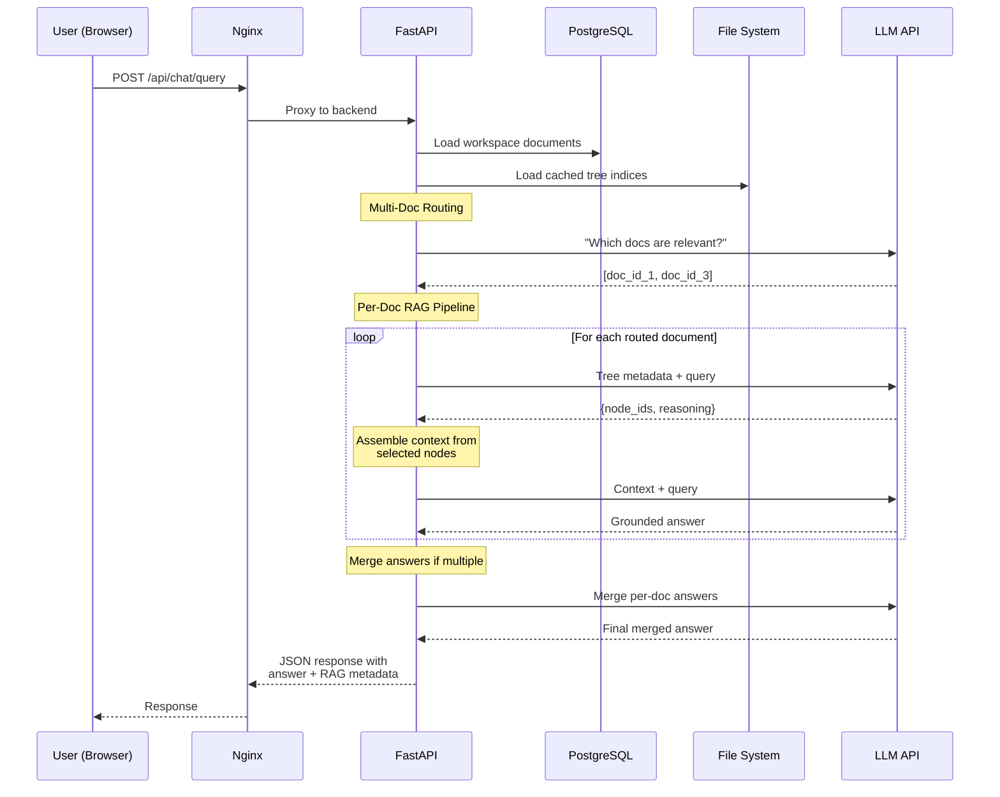

# System Architecture

## High-Level Overview

Vectorless RAG is a full-stack application with three deployment tiers: a **FastAPI backend**, a **React frontend**, and a **PostgreSQL database**, all orchestrated via Docker Compose.



---

## Component Architecture

### Frontend Stack

| Component | Technology | Purpose |
|-----------|-----------|---------|
| UI Framework | React 18 | Component-based SPA |
| Build Tool | Vite 5 | Fast HMR & production builds |
| Styling | Tailwind CSS 3 | Utility-first CSS |
| State | Zustand 4 | Lightweight state management with localStorage persistence |
| HTTP | Axios | API client with auth interceptors |
| Markdown | react-markdown + remark-gfm | Chat response rendering |
| Icons | Lucide React | Consistent icon set |
| Proxy | Nginx Alpine | Reverse proxy + static file serving |

**Key Architectural Decisions:**

- **Zustand with persistence**: App state (workspaces, documents, settings) survives page refreshes via `localStorage`. Chat messages are session-only.
- **SSE Streaming**: Chat responses stream token-by-token via `ReadableStream` parsing of Server-Sent Events, providing real-time feedback.
- **Nginx reverse proxy**: The frontend container proxies `/api/*` and `/v1/*` requests to the backend, enabling a single-origin architecture with no CORS issues in production.

### Backend Stack

| Component | Technology | Purpose |
|-----------|-----------|---------|
| Framework | FastAPI | Async-capable REST API |
| Server | Uvicorn | ASGI server |
| Database | SQLAlchemy 2.0 | ORM with repository pattern |
| Streaming | sse-starlette | Server-Sent Events |
| Validation | Pydantic v2 | Request/response schemas |
| Config | pydantic-settings | `.env` file management |
| Auth | Bearer Token | API key middleware |

### Data Layer

| Component | Technology | Purpose |
|-----------|-----------|---------|
| Database | PostgreSQL 16 | Workspace & document metadata |
| Tree Cache | JSON on filesystem | Cached tree indices (volume-mounted) |
| File Dedup | MD5 hashing | Prevent re-indexing identical files |

---

## Module Deep Dive

### `parsers/` -- Document Parsing



Every parser implements `BaseParser` and returns a flat list of `ParsedSection` objects. The **parser registry** (`parsers/registry.py`) maps file extensions to singleton parser instances:

| Extension | Parser | Library | Special Features |
|-----------|--------|---------|-----------------|
| `.pdf` | `PDFParser` | pypdfium2 | Heuristic heading detection (ALL-CAPS, numbered, Title Case), page image extraction |
| `.md`, `.markdown` | `MarkdownParser` | Built-in | Section splitting on headings |
| `.docx` | `DocxParser` | python-docx | Paragraphs and tables |
| `.pptx` | `PptxParser` | python-pptx | Slide-by-slide extraction |
| `.txt` | `TxtParser` | Built-in | Line-by-line parsing |

!!! info "PDF Heading Detection"
    The PDF parser uses heuristics to identify headings since PDFs don't have semantic heading markup. It detects:

    - **Chapter/Part/Section** keywords (Level 1)
    - **ALL-CAPS lines** under 120 characters (Level 1)
    - **Numbered headings** like `1.2.3 Title` (Level = depth of numbering)
    - **Title Case lines** under 100 characters with < 12 words (Level 2)

    If fewer than 2 headings are detected, it falls back to page-by-page chunking.

### `indexer/` -- Tree Construction

The `TreeBuilder` converts a flat list of `ParsedSection` objects into a hierarchical `TreeNode` tree:



**TreeNode Structure:**

```python
@dataclass
class TreeNode:
    node_id: str           # "root", "1", "1.2.3"
    title: str             # Section heading
    summary: str           # LLM-generated or text snippet
    start_page: int        # First page of section
    end_page: int          # Last page of section
    level: int             # Heading depth (0=root)
    text: str              # Full section text
    images: list[dict]     # Extracted images (base64)
    children: list[TreeNode]
```

**Two serialization modes:**

- `to_dict()` -- Full tree with text and images (for caching)
- `to_search_dict()` -- Lightweight: titles, summaries, page ranges only (for LLM search)

### `llm/` -- Provider Abstraction



The factory reads `settings.LLM_PROVIDER` and returns the appropriate implementation. Both providers are fully interchangeable at runtime.

### `retriever/` -- RAG Pipeline

The retriever orchestrates the three-stage pipeline. See [RAG Pipeline Deep Dive](pipeline.md) for the complete walkthrough.

### `backend/` -- API & Database



**Database Schema:**

The database uses two tables with `rag_` prefix (designed to coexist with other applications):

```sql
-- rag_workspaces
CREATE TABLE rag_workspaces (
    id          SERIAL PRIMARY KEY,
    name        VARCHAR(255) NOT NULL,
    description TEXT,
    owner_username VARCHAR(255) NOT NULL,
    created_at  TIMESTAMP WITH TIME ZONE,
    updated_at  TIMESTAMP WITH TIME ZONE,
    UNIQUE(owner_username, name)
);

-- rag_documents
CREATE TABLE rag_documents (
    id           SERIAL PRIMARY KEY,
    workspace_id INTEGER REFERENCES rag_workspaces(id) ON DELETE CASCADE,
    username     VARCHAR(255),
    file_name    VARCHAR(512),
    file_hash    VARCHAR(128),  -- MD5 for deduplication
    file_size    INTEGER,
    doc_title    VARCHAR(512),
    root_summary TEXT,
    node_count   INTEGER,
    image_count  INTEGER,
    page_count   INTEGER,
    created_at   TIMESTAMP WITH TIME ZONE,
    UNIQUE(workspace_id, file_hash)
);
```

---

## Request Flow

Here's the complete journey of a chat query through the system:



---

## Security

### Authentication

All API endpoints (except `/health` and `/`) require a Bearer token:

```
Authorization: Bearer <RAG_API_KEY>
```

The default key is `pageindex-secret-key`, configurable via `RAG_API_KEY` environment variable.

!!! warning "Production Deployment"
    Always change the default API key in production. Set `RAG_API_KEY` in your `.env.docker` file to a strong, unique value.

### CORS

The backend allows all origins (`*`) for development flexibility. In production, configure specific allowed origins via the CORS middleware settings.
