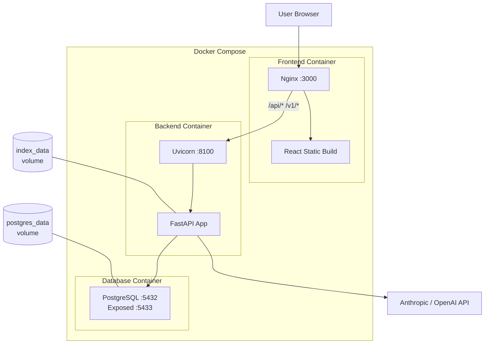

# Deployment Guide

## Docker Compose (Development & Production)

The primary deployment method uses Docker Compose with three services.

### Architecture



### Service Details

| Service | Image | Port | Volume | Health Check |
|---------|-------|------|--------|-------------|
| `postgres` | `postgres:16-alpine` | 5433 → 5432 | `postgres_data` | `pg_isready` |
| `rag-backend` | Custom (Python 3.11) | 8100 | `index_data` | Depends on postgres |
| `frontend` | Custom (Node → Nginx) | 3000 | None | Depends on backend |

### Docker Compose File

```yaml
services:
  postgres:
    image: postgres:16-alpine
    restart: unless-stopped
    env_file: .env.docker
    environment:
      POSTGRES_DB: ${POSTGRES_DB:-pageindex}
      POSTGRES_USER: ${POSTGRES_USER:-pageindex}
      POSTGRES_PASSWORD: ${POSTGRES_PASSWORD:-changeme}
    ports:
      - "5433:5432"
    volumes:
      - postgres_data:/var/lib/postgresql/data
    healthcheck:
      test: ["CMD-SHELL", "pg_isready -U ${POSTGRES_USER:-pageindex}"]
      interval: 5s
      timeout: 5s
      retries: 5

  rag-backend:
    build:
      context: .
      dockerfile: backend/Dockerfile
    restart: unless-stopped
    env_file: .env.docker
    ports:
      - "8100:8100"
    environment:
      DATABASE_URL: postgresql://${POSTGRES_USER:-pageindex}:${POSTGRES_PASSWORD:-changeme}@postgres:5432/${POSTGRES_DB:-pageindex}
    volumes:
      - index_data:/app/data/indices
    depends_on:
      postgres:
        condition: service_healthy

  frontend:
    build:
      context: ./frontend
      dockerfile: Dockerfile
    restart: unless-stopped
    ports:
      - "3000:3000"
    depends_on:
      - rag-backend

volumes:
  postgres_data:
  index_data:
```

### Commands

```bash
# Build and start all services
docker compose up --build

# Start in detached mode
docker compose up --build -d

# View logs
docker compose logs -f

# View specific service logs
docker compose logs -f rag-backend

# Stop all services
docker compose down

# Stop and remove volumes (DELETES ALL DATA)
docker compose down -v

# Rebuild a specific service
docker compose build rag-backend
docker compose up -d rag-backend
```

---

## Backend Dockerfile

The backend uses a multi-layer build for optimal caching:

```dockerfile
FROM python:3.11-slim

# System dependencies for document parsing
RUN apt-get update && apt-get install -y --no-install-recommends \
    build-essential \
    libpq-dev \
    && rm -rf /var/lib/apt/lists/*

WORKDIR /app

# Install Python dependencies first (layer caching)
COPY backend/requirements.txt /app/backend/requirements.txt
RUN pip install --no-cache-dir -r backend/requirements.txt

# Copy entire project (backend needs config/, indexer/, retriever/, etc.)
COPY . /app

# Create data directories
RUN mkdir -p /app/data/indices /app/data/uploads

ENV PYTHONPATH=/app
EXPOSE 8100

CMD ["uvicorn", "backend.main:app", "--host", "0.0.0.0", "--port", "8100", "--workers", "1"]
```

!!! note "Single Worker"
    The backend runs with `--workers 1` because the RAG pipeline uses synchronous LLM calls. For higher concurrency, consider running multiple containers behind a load balancer.

---

## Frontend Dockerfile

Multi-stage build: Node builds the React app, Nginx serves it:

```dockerfile
# Stage 1: Build
FROM node:20-alpine AS builder
WORKDIR /app
COPY package.json package-lock.json ./
RUN npm ci
COPY . .
RUN npm run build

# Stage 2: Serve
FROM nginx:alpine
COPY --from=builder /app/dist /usr/share/nginx/html
COPY nginx.conf /etc/nginx/conf.d/default.conf
EXPOSE 3000
CMD ["nginx", "-g", "daemon off;"]
```

### Nginx Configuration

The Nginx config handles:

- **SPA routing**: All non-file routes fall back to `index.html`
- **API proxying**: `/api/*` and `/v1/*` are proxied to the backend
- **SSE support**: Buffering is disabled for streaming chat responses
- **Static asset caching**: JS, CSS, images cached for 30 days

```nginx
server {
    listen 3000;
    root /usr/share/nginx/html;
    index index.html;

    # SPA fallback
    location / {
        try_files $uri $uri/ /index.html;
    }

    # API proxy with SSE support
    location /api/ {
        proxy_pass http://rag-backend:8100/api/;
        proxy_read_timeout 300s;
        proxy_buffering off;     # Critical for SSE
        proxy_cache off;
        proxy_http_version 1.1;
    }

    # OpenAI-compatible endpoint proxy
    location /v1/ {
        proxy_pass http://rag-backend:8100/v1/;
        proxy_read_timeout 300s;
        proxy_buffering off;
        proxy_cache off;
        proxy_http_version 1.1;
    }
}
```

---

## CI/CD with GitHub Actions

The project includes two GitHub Actions workflows that automatically build and push Docker images to **GitHub Container Registry (ghcr.io)**.

### Backend Pipeline

**Trigger paths:** `backend/`, `config/`, `indexer/`, `llm/`, `parsers/`, `retriever/`, `requirements.txt`

```yaml
# .github/workflows/backend-docker.yml
name: Build & Push Backend Docker Image

on:
  push:
    branches: [main]
    paths: [backend/**, config/**, indexer/**, llm/**, parsers/**, retriever/**, requirements.txt]
  pull_request:
    branches: [main]
    paths: [backend/**, config/**, indexer/**, llm/**, parsers/**, retriever/**, requirements.txt]
```

### Frontend Pipeline

**Trigger paths:** `frontend/**`

```yaml
# .github/workflows/frontend-docker.yml
name: Build & Push Frontend Docker Image

on:
  push:
    branches: [main]
    paths: [frontend/**]
  pull_request:
    branches: [main]
    paths: [frontend/**]
```

### How It Works

| Event | Action |
|-------|--------|
| **Push to `main`** | Build image + push to `ghcr.io` |
| **Pull request to `main`** | Build image only (validation, no push) |

### Image Tags

Each image is tagged with:

- **Git commit SHA** -- unique identifier for every build
- **`latest`** -- updated on every push to `main`
- **PR reference** -- for pull request builds

### Registry

Images are published to:

```
ghcr.io/srynyvas/vectorless-rag/backend:latest
ghcr.io/srynyvas/vectorless-rag/frontend:latest
```

### Using Pre-Built Images

To use the CI/CD-built images instead of building locally:

```yaml
# docker-compose.prod.yml
services:
  rag-backend:
    image: ghcr.io/srynyvas/vectorless-rag/backend:latest
    # ... same env and volume config

  frontend:
    image: ghcr.io/srynyvas/vectorless-rag/frontend:latest
    # ... same port config
```

---

## Production Considerations

### Security Checklist

- [ ] Change `RAG_API_KEY` from default value
- [ ] Change `POSTGRES_PASSWORD` from default value
- [ ] Configure specific CORS origins (currently allows `*`)
- [ ] Use HTTPS in production (add TLS termination at Nginx or load balancer)
- [ ] Never expose PostgreSQL port (`5433`) publicly

### Data Persistence

| Data | Location | Persisted By |
|------|----------|-------------|
| Database | PostgreSQL container | `postgres_data` Docker volume |
| Tree indices | Backend container `/app/data/indices` | `index_data` Docker volume |
| Uploaded files | Backend container `/app/data/uploads` | Not persisted by default -- add a volume if needed |

!!! warning "Uploaded Files"
    By default, uploaded files are stored inside the container and will be lost on rebuild. To persist them, add a volume mount:
    ```yaml
    rag-backend:
      volumes:
        - index_data:/app/data/indices
        - upload_data:/app/data/uploads  # Add this
    ```

### Scaling

The current architecture runs a single backend worker. For higher throughput:

1. **Horizontal scaling**: Run multiple backend containers behind a load balancer
2. **Shared storage**: Use a shared filesystem or object storage for tree indices
3. **Database pooling**: Configure SQLAlchemy connection pool size for concurrent connections
4. **Frontend**: Nginx is already highly concurrent -- a single frontend container handles many users

### Monitoring

```bash
# Check service health
curl http://localhost:8100/health

# View backend logs
docker compose logs -f rag-backend

# Check container resource usage
docker stats
```
