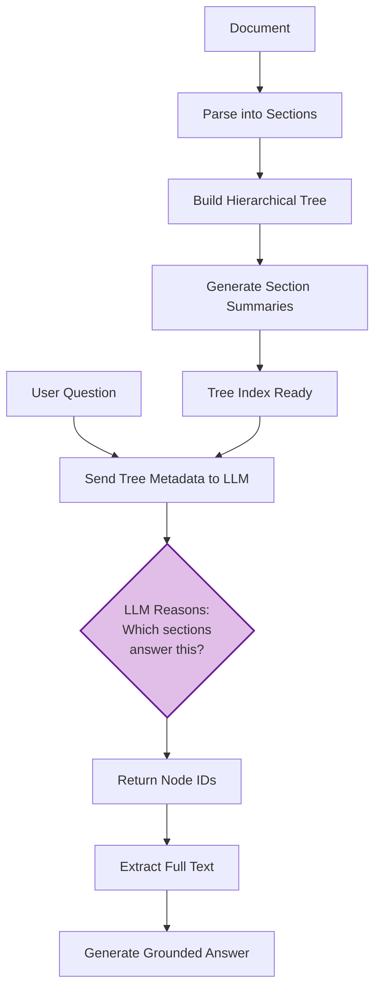

# The Intuition: Why Vectorless?

## The Problem with Traditional RAG

Traditional Retrieval-Augmented Generation (RAG) systems follow a well-established pattern:

1. **Chunk** documents into small pieces (typically 200-500 tokens)
2. **Embed** each chunk using a model like `text-embedding-ada-002` or `all-MiniLM-L6`
3. **Store** embeddings in a vector database (Pinecone, Chroma, Weaviate, etc.)
4. When a user asks a question, **embed the query** and find the most similar chunks
5. **Feed** those chunks to an LLM to generate an answer

This approach works, but it introduces several fundamental challenges:

### :material-puzzle: The Chunking Problem

How do you split a document? Fixed-size chunks break mid-sentence. Semantic chunks need careful tuning. Overlapping windows waste tokens. Every choice is a trade-off, and the "right" chunk size varies by document type, domain, and query style.

!!! warning "The Lost Context Problem"
    A chunk about "quarterly revenue of $2.3B" might not include which quarter or which year. The surrounding context that makes information meaningful often lives in a different chunk.

### :material-vector-combine: The Embedding Problem

Vector embeddings capture *semantic similarity*, but similarity is not the same as *relevance*. Consider:

- **"What is the company's revenue?"** is semantically similar to chunks about revenue, expenses, profit, and financial projections. The embedding model can't distinguish between what was asked and tangentially related concepts.
- **Negation blindness**: "The system does NOT use AES encryption" and "The system uses AES encryption" produce nearly identical embeddings.
- **Structural blindness**: Embeddings don't understand that Section 3.2 is a sub-section of Chapter 3, or that a conclusion summarizes earlier findings.

### :material-database: The Infrastructure Problem

Vector databases add operational complexity: deployment, scaling, index management, embedding model versioning, and re-embedding when models change. For many use cases, this is significant overhead.

---

## The Vectorless Alternative

Vectorless RAG takes a fundamentally different approach inspired by how **humans** search documents:

!!! tip "The Human Approach"
    When you need to find information in a textbook, you don't read every word. You look at the **table of contents**, scan **chapter titles** and **section headings**, read brief **summaries**, and then flip to the specific pages that seem most relevant.

Vectorless RAG does exactly this, but with an LLM doing the "scanning":



### How It Works

**Step 1: Build a Hierarchical Tree**

The document is parsed respecting its natural structure (headings, chapters, sub-sections). Each section becomes a node in a tree:

```
root: "Annual Report 2024"
├── 1: "Executive Summary" (Pages 1-3)
│   Summary: "Overview of key financial results and strategic initiatives..."
├── 2: "Financial Performance" (Pages 4-15)
│   Summary: "Detailed analysis of revenue, costs, and profitability..."
│   ├── 2.1: "Revenue Breakdown" (Pages 4-8)
│   │   Summary: "Revenue by segment: cloud 45%, enterprise 35%, consumer 20%..."
│   ├── 2.2: "Cost Analysis" (Pages 9-12)
│   │   Summary: "Operating costs decreased 8% YoY driven by automation..."
│   └── 2.3: "Profitability Metrics" (Pages 13-15)
│       Summary: "Net margin improved to 23%, EBITDA grew 12%..."
├── 3: "Technology & Innovation" (Pages 16-25)
...
```

**Step 2: LLM Reads the Tree (Not the Document)**

When a user asks *"What was the cloud revenue?"*, only the **lightweight tree metadata** (titles, summaries, page ranges -- no full text) is sent to the LLM. This is typically just a few hundred tokens, regardless of document size.

**Step 3: LLM Selects Relevant Sections**

The LLM reasons: *"The question is about cloud revenue. Node 2.1 'Revenue Breakdown' discusses revenue by segment including cloud. This is the most relevant section."*

It returns: `{"node_ids": ["2.1"], "reasoning": "..."}`

**Step 4: Retrieve and Answer**

The full text of Section 2.1 is extracted and sent to the LLM for answer generation, with proper citations.

---

## Head-to-Head Comparison

| Aspect | Traditional Vector RAG | Vectorless RAG |
|--------|----------------------|----------------|
| **Retrieval Method** | Cosine similarity in embedding space | LLM reasoning over document structure |
| **Index Size** | O(n) embeddings (768-1536 dims each) | One JSON tree (titles + summaries) |
| **Infrastructure** | Vector DB (Pinecone, Chroma, etc.) | Just a filesystem or any DB |
| **Chunking Strategy** | Critical decision, domain-dependent | Natural document structure (headings) |
| **Context Preservation** | Lost at chunk boundaries | Preserved in tree hierarchy |
| **Retrieval Explainability** | "Cosine similarity = 0.87" | "Selected Section 2.1 because it discusses revenue by segment" |
| **Multi-hop Reasoning** | Requires complex chain-of-retrieval | Natural -- LLM can select parent + child nodes |
| **Document Structure** | Destroyed during chunking | Preserved and leveraged |
| **Re-indexing Cost** | Re-embed everything | Rebuild tree (fast, no API calls for quick mode) |
| **Negation Handling** | Poor (embeddings are symmetric) | Good (LLM understands negation in summaries) |
| **Debugging** | Opaque (which chunks? why?) | Transparent (see tree, see reasoning, see context) |

---

## When Vectorless Works Best

Vectorless RAG excels with:

- :material-check-circle:{ style="color: green" } **Structured documents** -- reports, papers, manuals, specifications
- :material-check-circle:{ style="color: green" } **Documents with clear headings** -- the tree structure maps naturally
- :material-check-circle:{ style="color: green" } **Precise questions** -- "What does Section 5.2 say about..." maps directly to the tree
- :material-check-circle:{ style="color: green" } **Multi-section answers** -- the LLM can select multiple related sections
- :material-check-circle:{ style="color: green" } **Small-to-medium document collections** -- where per-query LLM calls are acceptable

Traditional vector RAG may be more appropriate for:

- :material-alert-circle:{ style="color: orange" } **Massive corpora** (millions of documents) where LLM-per-query cost matters
- :material-alert-circle:{ style="color: orange" } **Unstructured text** without clear section boundaries
- :material-alert-circle:{ style="color: orange" } **Real-time, high-throughput** scenarios (embedding lookup is faster than an LLM call)

---

## The Debugging Advantage

One of the most powerful benefits of Vectorless RAG is **full transparency**. The React UI includes a RAG Explorer panel with four tabs:

| Tab | What It Shows |
|-----|---------------|
| **Tree** | The complete hierarchical document structure -- click any node to see details |
| **Reasoning** | The LLM's explanation for *why* it selected specific sections |
| **Context** | The exact text that was fed to the answer-generation LLM |
| **Images** | Any images extracted from the selected sections |

When a traditional RAG system gives a wrong answer, debugging means inspecting embedding distances, chunk boundaries, and re-ranking scores. With Vectorless RAG, you can literally read the LLM's reasoning: *"I selected Section 4.1 because the user asked about authentication, and this section covers the OAuth implementation."* If the reasoning is wrong, you can see exactly where and why.

---

## The Key Insight

> **Documents already have structure. Traditional RAG destroys it. Vectorless RAG preserves and leverages it.**

A research paper has an abstract, introduction, methodology, results, and conclusion. A technical manual has chapters, sections, and sub-sections. A financial report has executive summaries, detailed analyses, and appendices.

This structure isn't noise -- it's *signal*. Authors organize information intentionally. By preserving that organization and asking an LLM to reason over it, we get retrieval that aligns with how the document was meant to be navigated.
