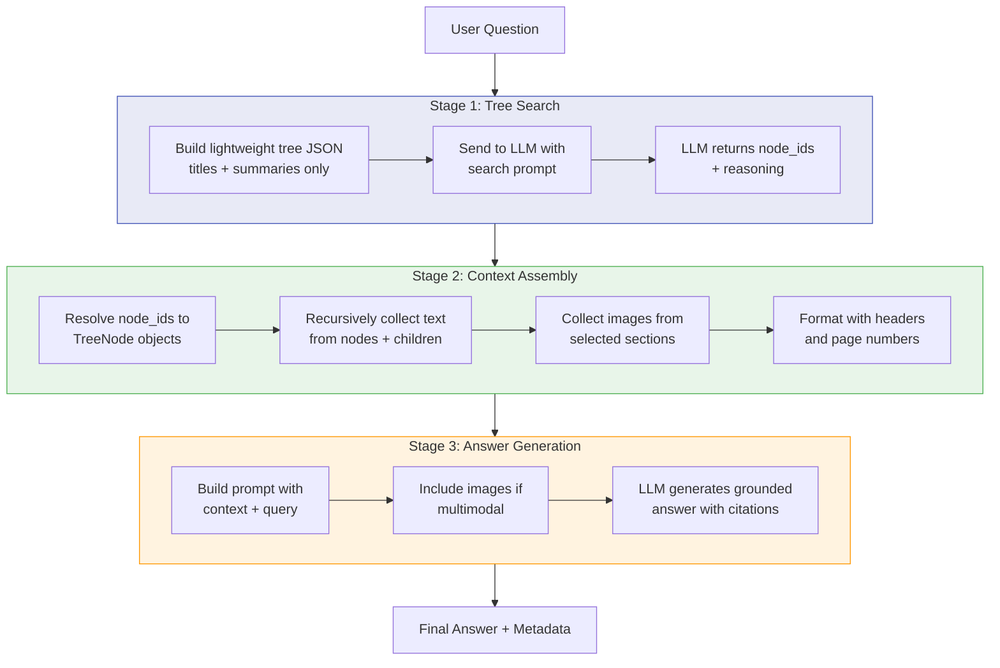
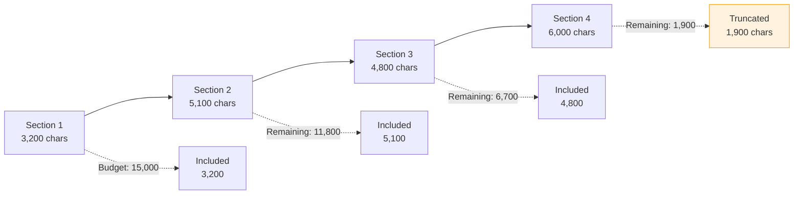
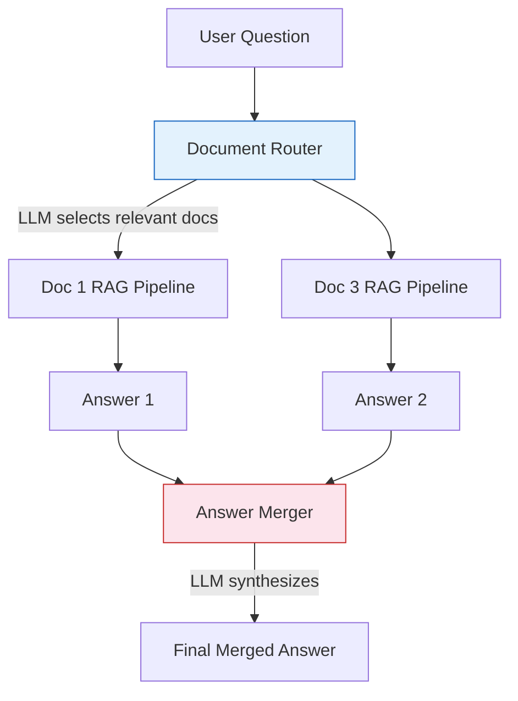

# RAG Pipeline Deep Dive

The heart of Vectorless RAG is a **three-stage retrieval pipeline** that replaces vector similarity search with LLM reasoning. This page walks through each stage in detail.

---

## Pipeline Overview



---

## Stage 1: Tree Search

**Goal:** Identify which sections of the document are relevant to the user's question, using *only* the tree structure -- not the full text.

### What Gets Sent to the LLM

The `TreeSearcher` calls `tree.to_json(include_text=False)` to produce a lightweight JSON representation:

```json
{
  "node_id": "root",
  "title": "Technical Architecture Guide",
  "summary": "Comprehensive overview of system architecture...",
  "children": [
    {
      "node_id": "1",
      "title": "System Overview",
      "summary": "High-level architecture with microservices...",
      "pages": "1-5",
      "children": [
        {
          "node_id": "1.1",
          "title": "Authentication Service",
          "summary": "OAuth 2.0 implementation with JWT tokens...",
          "pages": "2-3"
        },
        {
          "node_id": "1.2",
          "title": "Data Layer",
          "summary": "PostgreSQL primary with Redis caching...",
          "pages": "4-5"
        }
      ]
    }
  ]
}
```

!!! note "Token Efficiency"
    This lightweight JSON is typically **a few hundred tokens** regardless of the original document size. A 500-page document produces roughly the same search payload as a 5-page document (only more nodes in the tree).

### The Search Prompt

The system prompt instructs the LLM to:

1. Read the question carefully and identify key concepts
2. Walk through the tree evaluating each node's title and summary
3. Prefer **specific** nodes over broad parents (but select parents for multi-aspect questions)
4. Select **1 to 5** nodes maximum
5. Return a JSON object with `node_ids` and `reasoning`

### Response Parsing

**Primary path:** The LLM returns valid JSON:
```json
{
  "node_ids": ["1.1", "3.2.1"],
  "reasoning": "The question asks about authentication, which is directly covered in Section 1.1. Section 3.2.1 discusses security configurations related to auth."
}
```

**Fallback path:** If JSON parsing fails, the system:

1. Sends a raw text request with the same prompt
2. Extracts node IDs using regex: `\b(root|\d+(?:\.\d+)*)\b`
3. Validates extracted IDs against actual nodes in the tree (prevents hallucinated IDs)
4. Caps at 5 nodes

---

## Stage 2: Context Assembly

**Goal:** Extract the full text from selected sections and format it for the answer-generation prompt.

### Text Collection

For each selected node, the `ContextAssembler`:

1. **Resolves** node IDs to `TreeNode` objects via `tree.find_nodes_by_ids()`
2. **Recursively collects** all text from the node and its children (depth-first, preserving reading order)
3. **Formats** each section with a Markdown header:

```markdown
### Authentication Service (Pages 2-3)

OAuth 2.0 is implemented using JWT tokens for stateless authentication.
The service handles token issuance, validation, and refresh flows...

[Full section text here]
```

### Image Collection

For multimodal documents (PDFs with images):

1. Collects images from selected nodes and their children
2. Caps at `MAX_CONTEXT_IMAGES` (default: 10) images
3. Returns them as `{"data": base64, "media_type": "image/png", "caption": "..."}` dicts

### Context Budget

The assembler respects `max_context_chars` (default: 15,000 characters):

- Each section is added in order until the budget is reached
- If a section would exceed the budget but > 200 characters remain, it's **truncated** at a word boundary with a `[... section truncated]` note
- If < 200 characters remain, the section is **skipped entirely**



---

## Stage 3: Answer Generation

**Goal:** Produce a grounded, cited answer using only the retrieved context.

### The Answer Prompt

The system prompt enforces strict grounding rules:

1. **Ground every claim** in the provided content -- no outside knowledge
2. **Cite sources** with section titles: *(Section 3.2: Security Architecture)*
3. **Be precise** -- include numbers, specifics, and details from the source
4. **Acknowledge limitations** -- explicitly state what's not covered
5. **Structure clearly** -- use paragraphs, bullets, or numbered lists
6. **Analyze images** -- describe charts, diagrams, and tables when provided

### Multimodal Path

When images are available, the pipeline uses `generate_multimodal()`:

```python
content_blocks = [
    {"type": "text", "text": user_message},       # Context + query
    {"type": "image", "data": "...", "media_type": "image/png"},  # Chart
    {"type": "image", "data": "...", "media_type": "image/png"},  # Diagram
]
```

This allows the LLM to reference visual content in its answer:
> *"As shown in the architecture diagram (Page 12), the system uses a three-tier design with..."*

### Error Handling

If answer generation fails, the pipeline returns a user-friendly fallback:
> *"An error occurred while generating the answer. The relevant document sections were retrieved successfully -- please review the context directly or try again."*

---

## Multi-Document Pipeline

When a workspace contains multiple documents, an additional **routing stage** runs before the per-document RAG pipeline.



### Document Routing

The `DocumentRouter` sends document summaries to the LLM:

```json
{
  "documents": [
    {"doc_id": 1, "title": "API Reference", "summary": "REST API endpoints for..."},
    {"doc_id": 2, "title": "User Guide", "summary": "Step-by-step instructions for..."},
    {"doc_id": 3, "title": "Architecture Guide", "summary": "System design decisions..."}
  ]
}
```

The LLM selects **1-3 documents** most likely to answer the query. This avoids running the full tree search on every document.

### Answer Merging

If multiple documents produce answers, the merger LLM:

- Combines information from all sources
- Cites document names: *(from "API Reference")*
- Removes redundancy
- Produces a single coherent response

If only one document has useful content, it's returned directly without the merge step.

---

## Pipeline Return Value

The `RAGPipeline.query()` method returns a rich dictionary:

```python
{
    "answer": "The system uses OAuth 2.0 with JWT tokens for...",
    "node_ids": ["1.1", "3.2.1"],           # Selected sections
    "reasoning": "Selected authentication and security sections...",
    "context": "### Authentication Service (Pages 2-3)\n\n...",
    "image_count": 2,
    "images": [{"data": "...", "media_type": "image/png", "caption": "..."}]
}
```

This metadata powers the **RAG Explorer** panel in the React UI, giving users full transparency into the retrieval process.

---

## Performance Characteristics

| Operation | Typical Time | Depends On |
|-----------|-------------|------------|
| Tree Search (Stage 1) | 1-3 seconds | LLM latency, tree size |
| Context Assembly (Stage 2) | < 100ms | Number of selected nodes |
| Answer Generation (Stage 3) | 2-5 seconds | Context size, LLM latency |
| Document Routing | 1-2 seconds | Number of documents |
| **Total (single doc)** | **3-8 seconds** | LLM provider & model |
| **Total (multi-doc)** | **5-15 seconds** | Number of routed documents |

!!! tip "Quick Index Mode"
    Use Quick Index during document upload to skip LLM-generated summaries. This makes indexing nearly instant but uses text snippets as summaries, which may slightly reduce search accuracy.
